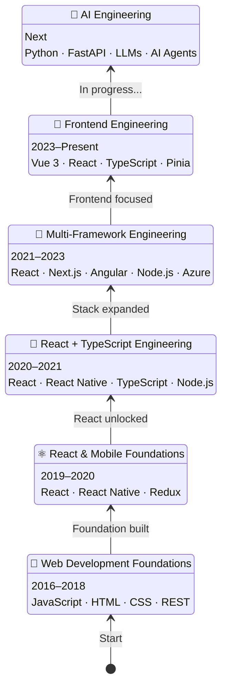
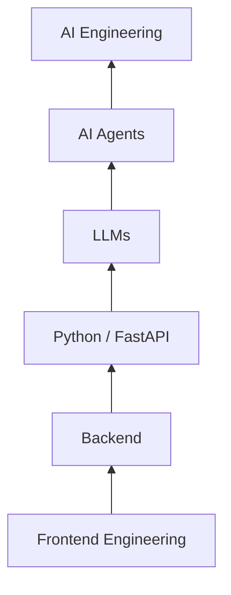

# 👋 Hi, I'm Vj

### Javascript Developer · Builder

I enjoy turning ideas into things that actually work — from **web applications and design systems to personal tools and DIY projects**.

My main playground is **React, Vue.js and TypeScript**, but I like exploring everything around them — backend, APIs, authentication, PWA, AI and system architecture.

---

## 🚀 My Developer Journey



---

## 🛠 What I Build With

```text
React · Vue 3 · TypeScript · JavaScript
Pinia · Redux · Vite · Tailwind CSS · SASS
REST APIs · Node.js · FastAPI
Keycloak · OAuth · Git · GitLab CI/CD
```

---

## 🧪 My Playground

### 📘 TextBook

A personal **React + TypeScript PWA** for notes, tasks and reminders.

I built it because I wanted one simple place for my everyday thoughts and tasks — with offline storage, Google Drive sync and eventually smart notifications.

`React` `TypeScript` `PWA` `IndexedDB` `Google Drive` `FastAPI`

### 🃏 RummyBook

A small idea that became an app.

Built to manage our **13-card Rummy games** — players, rounds, scores, history and who owes whom.

`React` `TypeScript` `IndexedDB`

---

## 🧠 What I'm Exploring Now



---

## 💡 How I Like to Work

> **Understand it → Build it → Break it → Improve it → Build it better.**

I love creating things myself — whether it's **code, an application, a design system, automation or something made from wood.** 🪵💻

---

### ⚡ Core

**React · Vue.js · TypeScript · Frontend Architecture · PWA · APIs**

### 🌱 Growing into

**Python · FastAPI · AI Engineering · LLMs · AI Agents**
