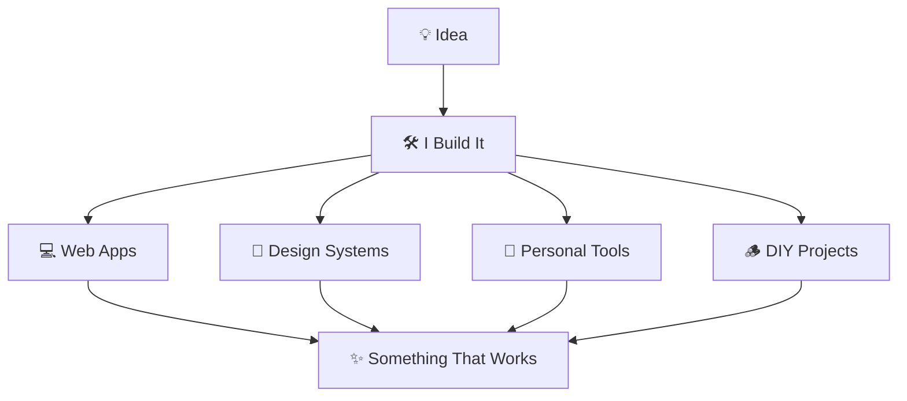
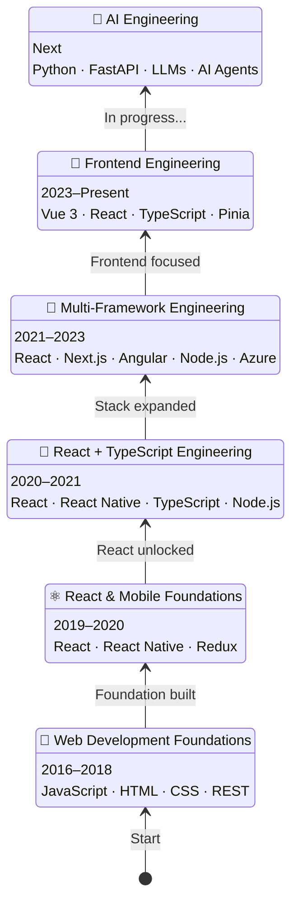

# 👋 Hi, I'm Vj <kbd>💻 Developer</kbd> <kbd>🛠️ Builder</kbd> <kbd>💡 Creator</kbd>

**<samp>I enjoy turning ideas into things that actually work</samp>**


---

## 🚀 My Developer Journey



---

## 🛠 What I Build With

```text
💻 Build      React · Vue · TypeScript
🧠 State      Pinia · Redux
🚀 Ship       Vite · Git · GitLab CI/CD
🔌 Connect    REST APIs · OAuth · Keycloak
🤖 Explore    Python · FastAPI · LLMs
```

---

## 🧪 My Playground

### 📘 TextBook

A personal **React + TypeScript PWA** for notes, tasks and reminders.

I built it because I wanted one simple place for my everyday thoughts and tasks — with offline storage, Google Drive sync and eventually smart notifications.

`React` `TypeScript` `PWA` `IndexedDB` `Google Drive` `FastAPI`

### 🃏 RummyBook

A small idea that became an app.

Built to manage our **13-card Rummy games** — players, rounds, scores, history and who owes whom.

`React` `TypeScript` `IndexedDB`

---

## 🧠 What I'm Exploring Now

<p align="center">
  <kbd>🤖 AI Engineering</kbd><br>
  ↑<br>
  <kbd>🧠 AI Agents</kbd><br>
  ↑<br>
  <kbd>✨ LLMs</kbd><br>
  ↑<br>
  <kbd>🐍 Python / FastAPI</kbd><br>
  ↑<br>
  <kbd>⚙️ Backend</kbd><br>
  ↑<br>
  <kbd>💻 Frontend Engineering</kbd>
</p>

---

### ⚡ Core

**React · Vue.js · TypeScript · Frontend Architecture · PWA · APIs**

### 🌱 Growing into

**Python · FastAPI · AI Engineering · LLMs · AI Agents**
