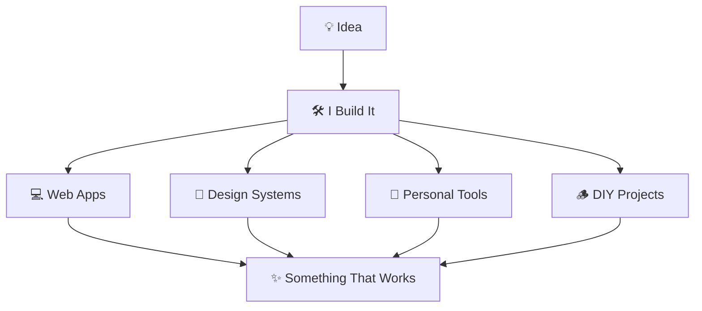
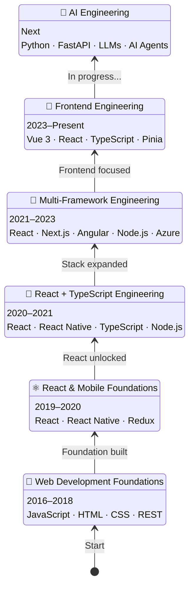

#   Hi, I'm Vj <kbd>💻 Frontend Developer</kbd> <kbd>🛠️ Builder</kbd> <kbd>💡 Creator</kbd>

<!--  -->

<h2>
  🧰 My Toolkit
  
  
  
  
  
  
  
  
  
</h2>

### 🧠 Exploring <kbd>🤖 AI Engineering</kbd> <kbd>🧠 AI Agents</kbd> <kbd>✨ LLMs</kbd> <kbd>🐍 Python</kbd> <kbd>⚡ FastAPI</kbd> <kbd>⚙️ Backend</kbd> 

### 🎓 My studies took me to  in <kbd>Paris 🇫🇷</kbd> for a <kbd>Master’s in Software Engineering</kbd>

---
### **
<samp>I enjoy turning ideas into things that actually work</samp>
**

---
## 🧪 My Playground

###  [TextBook](https://vsp4994.github.io/textbook/)

<samp>I built TextBook for notes, tasks and reminders with offline storage, Google Drive sync and notifications.</samp>

`React` `TypeScript` `PWA` `IndexedDB` `Google Drive` `FastAPI`

<!--  -->
### [Clock247](https://vsp4994.github.io/clock247/)

<samp>I built Clock247 as a clock dashboard with world times, alarms, notes, live weather, and an always-on display.</samp>

`React` `PWA` `Sass` `LocalStorage` `Open-Meteo API`

<!--  -->
### [Rummy](https://vsp4994.github.io/rummy/)

<samp>I built [Indian Rummy](https://en.wikipedia.org/wiki/Indian_Rummy) to play and track — a 13-card game — with players, rounds, scores, history, and who owes whom.</samp>

`React` `TypeScript` `IndexedDB`

---

## 🚀 My Developer Journey

